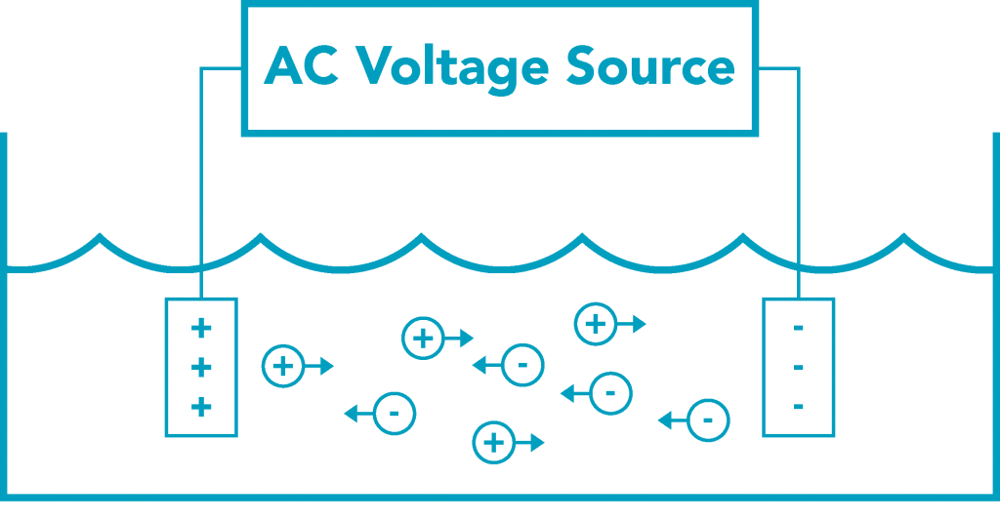
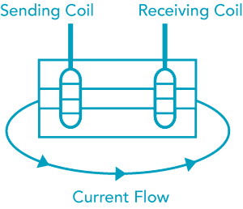
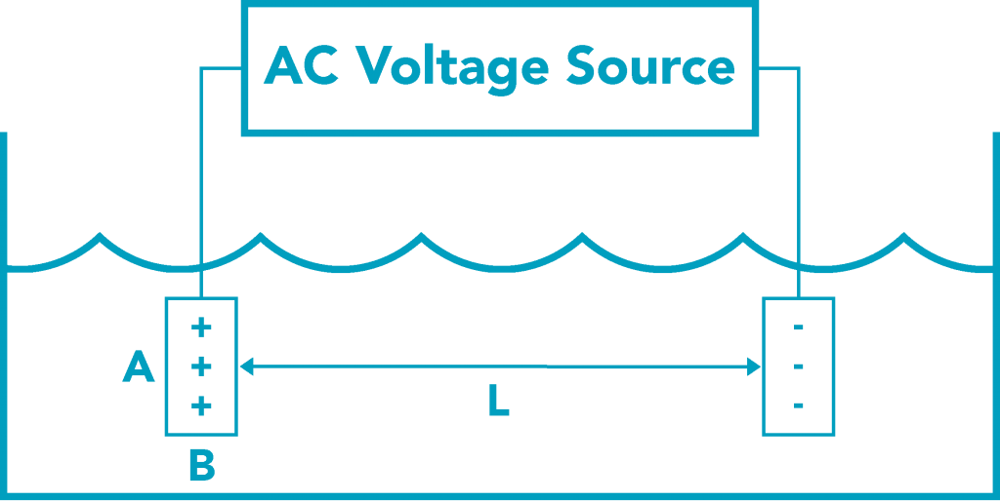

## Độ dẫn điện là gì?

Độ dẫn điện biểu diễn khả năng dẫn dòng điện của một dung dịch. Đơn vị của độ dẫn điện là microsiemen (micro-Siemens trên centimeter µS/cm) hoặc cao hơn nữa là millisiemen.

Một số ứng dụng công nghiệp như hệ thống xử lý nước sử dụng một phép đo là TDS (Total Dissolved Solids - tổng chất rắn hoà tan) để đánh giá hệ thống. Giá trị TDS được lấy xấp xỉ với độ dẫn điện nhân với một hệ số và biểu diễn bằng đơn vị ppm (parts per million - một phần triệu).

## Việc đo TDS/Độ dẫn điện như thế nào?

### Cảm biến độ dẫn điện có tiếp xúc

Cảm biến độ dẫn điện có tiếp xúc (phân biệt với cảm biến độ dẫn điện cảm ứng - không tiếp xúc) đo độ dẫn điện với 2 bản điện cực trong mẫu dung dịch. Hai bản điện cực đó có thể làm bằng graphite, thép không rỉ, platium hoặc các vật liệu tương tự.

Cho một điện áp xoay chiều đi qua một bản điện cực của cảm biến và nó sẽ đi qua mẫu dung dịch được đo. Bản điện cực còn lại sẽ nhận tín hiệu đó. Kết quả nhận được sẽ xác định được độ dẫn điện của dung dịch đó và được thể hiện ra giá trị độ dẫn điện theo microsiemens, millisiemens hoặc tổng chất rắn hoà tan (ppm).



### Cảm biến độ dẫn điện vòng xuyến (cảm ứng)

Cảm biến độ đẫn điện vòng xuyến bao gồm hệ thống 2 cuộn cảm cảm ứng từ trong một vỏ nhựa trơ (không dẫn điện). Cuộn cảm phát tạo ra một từ trường, mà nó sẽ tạo ra dòng điện cảm ứng xung quanh dung dịch được đo. Độ mạnh của dòng điện đó, nó sẽ cung cấp một trường điện từ cho cuộn cảm thu, sẽ tỉ lệ với mật độ của ion trong dung dịch.

Hệ thống cảm ứng này có thể loại trừ hiệu ứng phân cực mà có thể tạo ra sự không ổn định của phép đo với cảm biến độ dẫn điện tiếp xúc. 

Cảm biến vòng xuyến cũng có thể ngăn ngừa việc bám bẩn do cuộn cảm không tiếp xúc với mẫu dung dịch. Vì thế, cảm biến vòng xuyến đã trở thành tiêu chuẩn trong các ứng dụng với độ dẫn điện cao, như là hệ thống xử lý hoá học, các tháp giải nhiệt và quan trắc nước biển.



## Các loại cảm biến độ dẫn điện

Cảm biến độ dẫn điện có nhiều đặc điểm khác nhau để tạo nên những sản phẩm phù hợp với các ứng dụng khác nhau. 

Với cảm biến độ dẫn điện tiếp xúc, đặc điểm chính để tạo nên các cảm biến khác nhau chính là hệ số K (conductivity cell constant)

### Hệ số K là gì?

Một điện cực độ dẫn điện tiếp xúc gồm 2 hoặc nhiều hơn các bản điện cực. Hệ số K tỉ lệ trức tiếp tới khoảng cách giữa 2 bản điện cực và tỉ lệ nghịch đảo với diện tích tiếp xúc của chúng.

```
K = L/a, với a (area) = A x B
```
Giá trị độ dẫn điện thực tế = độ dẫn điện đo được (G) x hệ số K



### Cách lựa chọn hệ số K

Một hệ số K = 1.0 sẽ tạo ra giá trị độ dẫn điện đo được (G) xấp xỉ bằng với độ dẫn điện thực tế của dung dịch. Tuy nhiên, hệ số K = 1.0 không phải lúc nào cũng là lựa chọn thích hợp. 

Ví dụ, với các dung dịch có độ dẫn điện rất thấp, các bản điện cực đo phải đặt gần nhau hơn để tạo ra một tín hiệu tốt hơn cho cảm biến độ dẫn điện. Khi đó độ dài của bản điện cực giảm xuống, hệ số K cũng giảm xuống 0.1 hoặc 0.01. 

Ngược lại, khi dung dịch có độ dẫn điện lớn, độ dài bản điện cực dài hơn (hệ số K lớn hơn) lên 10 hoặc 100 để tạo giá các số đo chính xác hơn.

Lựa chọn cảm biến độ dẫn điện với hệ số K thích hợp với dung dịch mà bạn muốn đo, khoảng độ dẫn điện trong các dung dịch điển hình và hệ số K tối ưu cho mỗi khoảng như bảng sau đây:

| Dung dịch 	| Khoảng độ dẫn điện | Hệ số K tối ưu |
| ------------  | ------------------ | -------------  |
| Nước tinh khiết | 0.05 μS/cm | 0.01 |
| Nước cho hệ thống làm mát nguồn điện | 0.05-1 μS/cm | 0.01 hoặc 0.1 |
| Nước uống | 150-180 μS/cm | 1.0 |
| Nước cho tháp làm mát | 0-5 mS/cm | 1.0 |
| Nước thải | 0.9-9 mS/cm | 1.0 |
| Nước biển | 53mS/cm | 10 |
| Axit nitric 29% | 856 mS/cm | 100 |

**Lưu ý:** không nên chọn cảm biến với hệ số K = 10 hoặc 100, vì khi đó khoảng cách giữa 2 điện cực rất nhỏ, rất dễ bị bụi bẩn bám vào và bị kẹt ở đó. Hãy chuyển sang sử dụng cảm biến vòng xuyến.

### Phân loại cảm biến độ dẫn điện

Cảm biến độ dẫn điện cũng được chia theo 2 loại chính là loại sử dụng trong phòng thí nghiệm và sử dụng công nghiệp.


 

