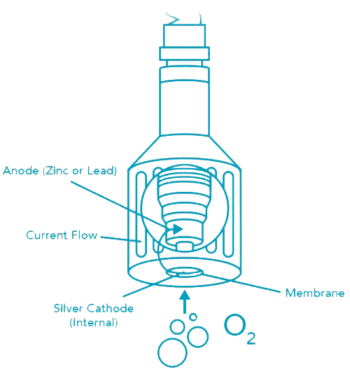

## Độ oxy hoà tan là gì? (Dissolved Oxygen - DO)

Độ oxy hoà tan (DO) là một lượng oxy được hoà tan trong một đơn vị nước. Oxy đi vào nước bằng cách:

* Khuếch tán trong không khí xung quanh.
* Sự sục khí.
* Kết quả của quá trình quang hợp của thực vật trong nước.

## Đo lượng oxy hoà tan bằng cách nào?

### Cảm biến đo oxy hoà tan galvanic

Cảm biến DO galvanic gồm có 2 điện cực: anode và cathode. Cả 2 điện cực này đều được nhúng vào chất điện phân (bên trong thân cảm biến). Một màng oxy thấm qua được phân tách anode và cathode với mẫu đo.

Màng thẩm thấu cho phép oxy từ mẫu nước khuếch tán vào cảm biến, nơi mà chúng bị khử tại cathode. Phản ứng hoá học này tạo ra một tín hiệu điện, mà nó sẽ đi từ cathode tới anode. 

Sự tiêu thụ oxy tại cathode tạo ra một áp suất chênh lệch qua màng mà nó làm thay đổi áp suất thực tế của oxy trong mẫu nước. Vì vậy, mật độ oxy tăng lên, áp suất thực tế và tốc độ khuếch tán cũng tăng lên, và dòng điện tạo ra của cảm biến cũng tăng lên tương ứng.

### Cảm biến DO quang

Cảm biến DO quang với các thành phần sau: một loại thuốc nhuộm sẽ phát quang (phát sáng màu đỏ) khi tiếp xúc với ánh sáng có bước sóng cụ thể. Thuốc nhuộm được bao phủ bởi một lớp sơn thấm oxy, mà nó cho phép phân tử oxy tác động với thuốc nhuộm, đồng thời bảo vệ nó khỏi các thành phần khác của mẫu nước. 

Oxy tương tác với sự phát quang của thuốc nhuộm (cường độ và thời gian phát quang). Cảm biến phát ra ánh sáng và tính toán kết quả phát quang với một photodiode. Giá trị đọc được này sẽ được so sánh với giá trị tham chiếu sử dụng ánh sáng có bước sóng khác. Giá trị của phép đo và giá trị tham chiếu được so sánh để tính toán ra độ oxy hoà tan trong mẫu đo.

## Phân loại cảm biến DO

Cảm biến DO được phân thành 2 loại chính như sau:

* Loại cảm biến Galvanic nhỏ: tần suất sử dụng ngắn, thường được sử dụng trong phòng thí nghiệm hoặc máy cầm tay.
* Loại cảm biến cho công nghiệp: sử dụng cảm biến galvanic loại lớn hoặc cảm biến DO quang.

