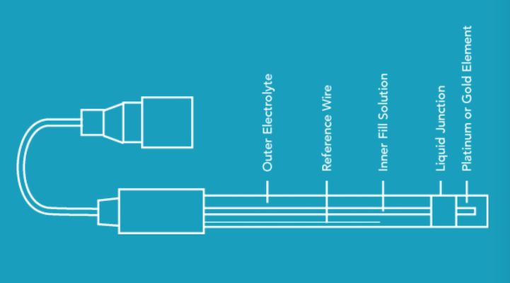

## ORP là gì

Khả năng oxy hoá-khử Oxidation reduction potential (ORP), cũng được biết như là REDOX, là một đại lượng mà nó phản ánh khả năng của nước để oxy hoá các chất ô nhiễm:

* Sự oxy hoá: là mất các electron, vì thế các chất oxy hoá chấp nhận các electron từ các phân tử khác.
* Sự khử: là làm tăng các electron, vì thế các chất khử đóng góp các electron tới các phân tử khác. 

Khả năng oxy hoá-khử được đo như một đại lượng điện áp theo millivolts (mV). Các chất oxy hoá có giá trị ORP dương, trong khi đó các chất khử có giá trị ORP âm.

| Mức ORP (mV) | Ứng dụng |
| ------------ | ------------- |
| 0-150 | Không có ứng dụng thực tế  |
| 150-250 | Nuôi trồng thuỷ sản  |
| 250-350 | Tháp giải nhiệt  |
| 400-475 | Hồ bơi  |
| 450-600 | Bồn tắm nước nóng  |
| 600 | Nước tẩy  |
| Nước tẩy màu | Nước sát trùng  |

## ORP được đo như thế nào?

Sử dụng một cảm biến điện hoá đo ORP, cảm biến đó được gọi là cảm biến ORP hay cảm biến REBDOX. Tương tự như cảm biến pH, hầu hết cảm biến ORP là loại cảm biến kết hợp với một điện cực để đo và một điện cực tham chiếu. Điện cực đo, thông thường là một kim loại quý như platin hoặc vàng, phát hiện sự thay đổi của khả năng REDOX, trong khi đó điện cực tham chiếu cung cấp một tín hiệu so sánh ổn định.

Giống như việc đo pH, việc đo ORP không trực tiếp biểu hiện mật độ, đúng hơn là biểu hiện sự hoạt hoá. Tuy nhiên, trong các dung dịch với một loại hoạt hoá, như hồ bơi có nhiều Clo, ORP có liên quan tới mật độ.

## Tại sao việc đo ORP lại cần thiết?

Phép đo ORP là một phương pháp giá rẻ để quan trắc sự thay đổi của một môi trường. Các ứng dụng chính gồm các ứng dụng khử trùng sử dụng clo, ozone và brom. Tất cả các chất đó có tính oxy hoá rất mạnh, vì thế ORP được sử dụng để chỉ thị sự hoạt hoá của việc khử trùng. 

ORP cũng được sử dụng trong những ứng dụng quan trắc sự phá huỷ của crôm-mát hoặc xyanua, như trong các sản phẩm tẩy trắng và các bộ lọc ẩm.

## Các loại cảm biến ORP

Cũng như cảm biến pH, cảm biến ORP được chia thành 2 loại chính là:

* Cảm biến sử dụng trong phòng thí nghiệm. 
* Cảm biến sử dụng trong công nghiệp: thân cảm biến được làm chắc chắn hơn và có các kết nối (connector) công nghiệp. Sử dụng đo liên tục.

 

